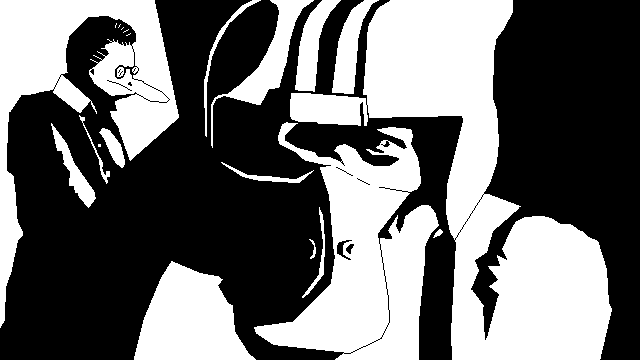

# Gravity Run

**Gravity Run** is a gravity-driven arcade shmup / endless-runner prototype built in Godot, starring Commander Quacker.

What began as a compact game-jam experiment has grown into a short campaign, an endless arcade mode, a small cast of aggressively spacefaring birds, and a ship system with multiple weapons and upgrades.

## The hook

You are flying through a hostile field of asteroids while gravity itself becomes part of the problem.

Asteroids can pull on nearby objects, gravity can invert around the black-hole mechanics, and survival is not always as simple as shooting everything in front of you. Movement, positioning, momentum, and deciding when *not* to destroy an asteroid are part of the original design.

## Current game

The current project includes:

- a short campaign featuring **Commander Quacker**, General Goose, and an alien challenge;
- an **endless mode** that unlocks after campaign completion;
- asteroid spawning and gravity interactions;
- black-hole and inversion visual effects;
- player health, kill tracking, leveling, and level-up flow;
- configurable ship upgrades and multiple weapon families;
- cannon, laser, torpedo, and bomb systems;
- keyboard movement and gamepad support;
- dialogue, cutscenes, announcements, menus, pause, and game-over flow;
- Web, Linux, and Windows export presets.

The project is still a **playable prototype / work in progress**, not a finished commercial release.

## Campaign

The current short campaign is titled:

> **Commander Quacker and the Quack in the Spacetime Continuum**

Commander Quacker is challenged to race for the fate of duck-kind, because apparently spacetime did not have enough problems already.

## Controls

### Keyboard

- **WASD / Arrow keys** — movement
- **Space** — cannon; also advances dialogue / confirms menu actions where applicable
- **X** — laser
- **C** — torpedo
- **V** — small bomb
- **Esc** — pause / resume
- **Enter** — menu confirmation where applicable

### Gamepad

The project includes controller navigation, movement, and mapped actions for the ship's weapon systems. Campaign dialogue progression is currently keyboard-driven and needs controller-input cleanup before a polished release.

## Running the project

The repository currently targets **Godot 4.2**.

1. Clone the repository.
2. Open the project directory in Godot 4.2 or a compatible Godot 4 release.
3. Run the project from `main.tscn`.

The project contains export presets for:

- Web
- Linux/X11
- Windows Desktop

## Project structure

A few useful starting points:

- `main.tscn` / `main.gd` — application entry point and pause/game-over handling
- `stages/` — stage loading, campaign stage, endless/demo stage, backgrounds, and music
- `player/` — ship, weapons, state, upgrades, and player UI
- `asteroid/` — asteroid behavior and spawning
- `black_hole/` — black-hole behavior and visual effects
- `cut_scenes/` — dialogue and campaign cutscene sequencing
- `lib/` — reusable gameplay systems including gravity, spawning, movement, and event sequencing
- `ui/` — menus, announcements, dialogue, and title screen
- `design.md` — the original game-jam design document; useful historical context, but no longer a complete description of the current game

## Development status

The codebase contains more gameplay systems than finished content. In particular, the player/upgrades infrastructure is substantially broader than the current campaign. The next development milestone should be driven by playtesting and scope validation rather than adding more systems by default.

## Licensing status

The repository's current root `LICENSE` file appears to belong to the bundled GodotSfxr component and **should not be interpreted as a project-wide license for Gravity Run**.

The repository also contains third-party shaders, audio, plugins, and other components that may have separate attribution or licensing requirements. Ownership, contributor rights, and third-party notices need to be reviewed and made explicit before commercial distribution.

Until that cleanup is complete, do not assume that the game or all bundled assets are covered by the root MIT license.
